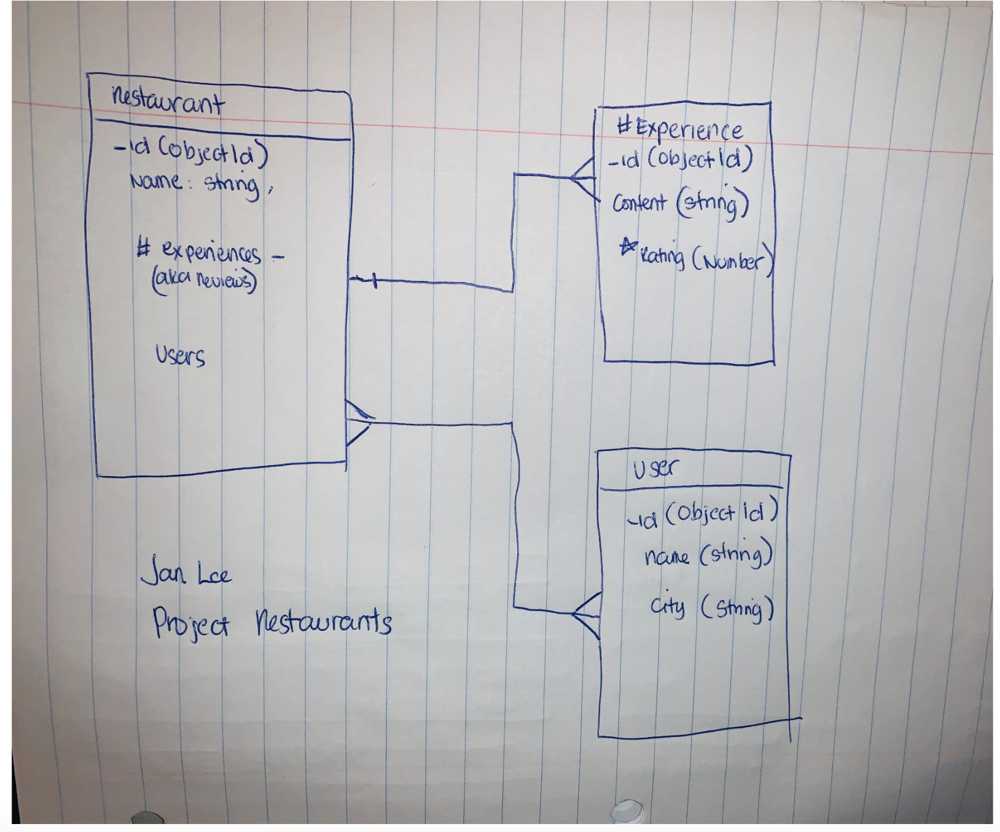

# Restaurants
- Oh for the Love of Food

## Objective:
  - Create a  full stack application using MEN development tools and enjoy!

## To play the game:
- Click here(https://foodloverz.herokuapp.com/restaurants) to see my project.

## Motivation:
- Austin food scene has transformed into a mecca of experience and exploration especially for food lovers. From one humble heart of a food truck operator to an experienced or well known executive chefs who brings love, flavor and experiences to their dishes. There's no wonder why like many others, I have a long list of restaurants to visit around town! So, creating an app that list all these amazing places to showcase our very own Austin is a no brainer.

## Developer Ahas:
Have a back up plan.

## User Story:
Marie is a fun loving yet uptight tech company CEO who is going to Austin for a 4 day conference. She has never been to Austin and was expecting a bunch of horses and cowboys/cowgirls roaming around town. 
By some twist of fate she saw and flagged down Sam Grey Horse for local advice. Sam gladly pulled out his phone to show her the list of amazing food places to try in Austin! And so Marie had indulge in guilt and pleasure at Gourdough's public house and also had a quiet dinner at Josephine's as well as Odd Duck. Thanks to Sam Grey Horse and Food Lovers Marie can't wait to visit Austin again!

## Prototype View:
- Here is my initial drawing of the playing field:

- Here is an initial wire-frame of how the playing field will be set up:

- Here is what the playing field looks like, post styling:

- Trello
https://trello.com/b/jxeRKnbq/project-2

![player blackjack]

![dealer win]

## Technology Implemented:
JavaScript
CSS
HTML
Git
Google Fonts
CSS Tricks
NodeJS
Express

## Pseudocode:
![Inital Plan]

## Minimum Viable Product:

- As a user I should be able to login in to the site
- As a uAs a User I should be able to GET a list of restaurants on page load
- As a User I should be able to PUT restaurants to the database
- As a user I should be able to DELETE a restaurant from the database
- As a User I should be able to UPDATE a restaurant
- As a user I should be able to see a list of restaurants with their DETAILS
- As a user I want to be able to POST my experiences to a restaurant record

## Stretch Goals:
Mobile responsiveness
More styling and theme
As a user I should be able to SEARCH the database for restaurant
Allow user to upload a photo of their dish and store in the restaurant collection

## Credits:
Styling:
Materialize: https://materializecss.com/
LearnWebCode : https://youtu.be/k32voqQhODc
File Upload: https://github.com/pqina/filepondttp://programmerblog.net/nodejs-file-upload-tutorial/
layout/upload
Tutorials:
https://github.com/WebDevSimplified/Mybrary/tree/v1.3/views/layouts

